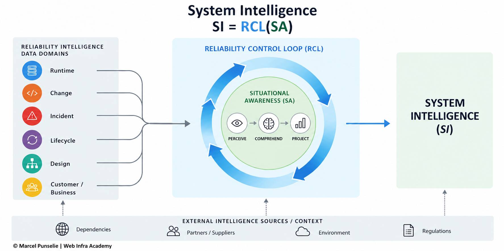
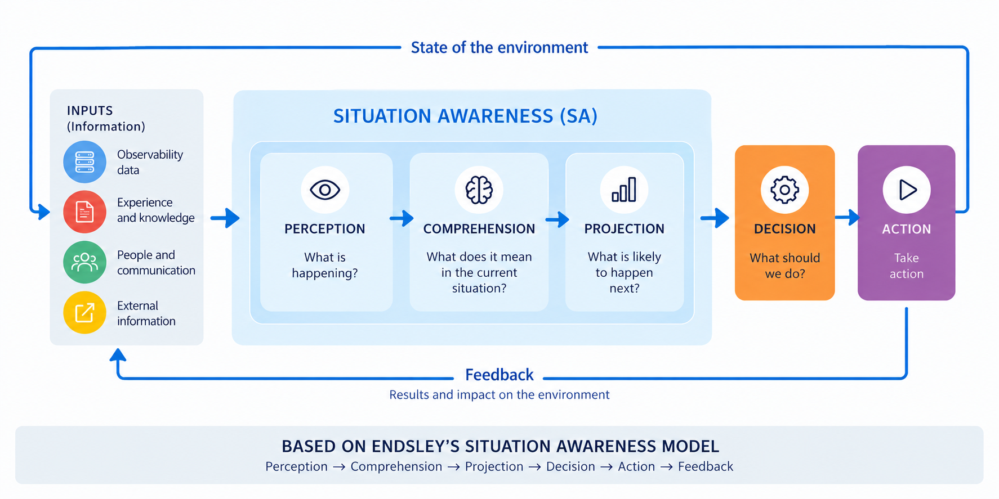
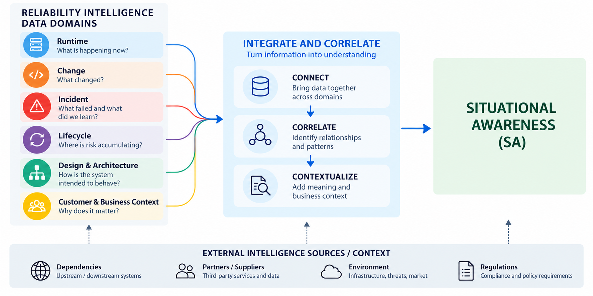
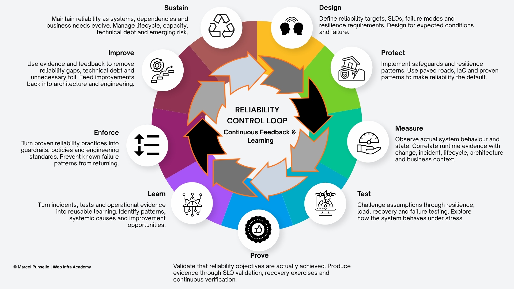

# System Intelligence

**A reliability-engineering perspective on System Intelligence**

> **SI = RCL(SA)**

System Intelligence is the capability of a socio-technical system to continuously understand its state and context, anticipate emerging conditions, and use that understanding to guide decisions and actions, validate their outcomes, and learn from the results.

This repository explores a simple proposition:

**System Intelligence emerges when Situational Awareness is continuously operationalized and improved through a Reliability Control Loop.**

The notation `SI = RCL(SA)` is conceptual, not mathematical. It describes the relationship between Situational Awareness (SA), continuous reliability control (RCL), and the resulting capability I call System Intelligence (SI).

## The model

The model brings together Situational Awareness, the information needed to build it, and a Reliability Control Loop that turns understanding into continuous adaptation:

### 1. Situational Awareness

Based on the established work of Mica Endsley:

**Perceive → Comprehend → Project**

Situational Awareness turns signals and information into an understanding of what is happening, what it means, and what may happen next.

### 2. Six data domains

Reliable Situational Awareness requires a wider field of view than runtime telemetry alone.

The current model distinguishes six data domains:

1. **Runtime** — What is happening now?
2. **Change** — What changed?
3. **Incident** — Where has the system failed and what did we learn?
4. **Lifecycle** — Where is risk accumulating over time?
5. **Design & Architecture** — How was the system intended to work?
6. **Customer & Business Context** — Why does it matter?

   

The value is not in the individual data domains. It emerges when information across those domains can be **connected, correlated and contextualized**.

**System Intelligence emerges from the relationships between the data, not from the data alone.**

### 3. Reliability Control Loop

Situational Awareness alone does not change a system.

The Reliability Control Loop (RCL) operationalizes that understanding through nine interconnected phases:

**Design → Protect → Measure → Test → Prove → Learn → Enforce → Improve → Sustain**

The important part is not any individual phase. It is the feedback between them.

Actions generate outcomes. Outcomes generate evidence. Evidence creates learning. That learning feeds back into how systems are designed, protected and operated.

## Why this repository exists

This is not presented as a finished theory.

The purpose of this repository is to expose the model to practitioners, architects, SREs, engineers and researchers who can challenge it with real-world experience.

In particular, I am looking for feedback on three questions:

- **Does `SI = RCL(SA)` adequately describe the relationship between understanding and continuous reliability control?**
- **Are the six data domains sufficient, distinct and useful? What is missing or redundant?**
- **Do the nine phases of the Reliability Control Loop form a useful continuous reliability lifecycle? Where does the loop break down?**

Counter-examples and disagreement are particularly valuable.

## Contributing

The easiest way to contribute is to open an **Issue**.

Use Issues to:

- challenge an assumption;
- propose a missing or different data domain;
- challenge, combine, split or reorder an RCL phase;
- provide a real-world example or counter-example;
- identify where the model does not work.

The model will evolve as useful feedback and evidence emerge.

## About

This work is developed by **Marcel Punselie**, reliability engineering trainer and IT architect, and founder of **Web Infra Academy**.

Web Infra Academy: https://www.webinfraacademy.com

LinkedIn: https://www.linkedin.com/in/celtic/

## References

- Endsley, M. R. (1995). *Toward a Theory of Situation Awareness in Dynamic Systems*. Human Factors, 37(1), 32–64.
- Åström, K. J., & Murray, R. M. (2008). *Feedback Systems: An Introduction for Scientists and Engineers*. Princeton University Press.
- Feng, X. et al. (2025). *Defining System Intelligence*. ACM SIGOPS.
- Pahi, T., Leitner, M., & Skopik, F. (2017). *Analysis and Assessment of Situational Awareness Models for National Cyber Security Centers*. ICISSP.

## License

Licensing information will be added before the first public release.

---

**Because a model about continuous learning should itself be capable of learning.**
